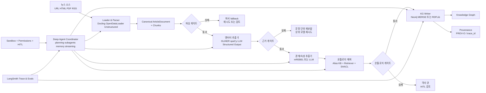

# LangChain DeepAgents와 뉴스 기사 온톨로지 기반 지식그래프 설계

## 경영진 요약

LangChain의 **Deep Agents**는 LangChain/LangGraph 위에 얹힌 “에이전트 하니스”로, 일반적인 툴 호출 루프에 더해 **작업 계획**, **서브에이전트 위임**, **가상 파일시스템과 백엔드**, **장기 메모리와 스킬**, **컨텍스트 압축**, **사람 승인**, **스트리밍/관측성** 같은 기능을 기본 제공하는 것이 핵심입니다. 즉, “LLM 한 번 호출”보다 “여러 단계로 오래 달리는 작업”에 맞춘 실행 껍데기라고 보는 편이 정확합니다. LangChain 공식 문서는 Deep Agents를 복잡하고 긴 작업에 적합한 “batteries-included agent harness”로 설명하고, GitHub README도 같은 방향으로 정의합니다. citeturn22view2turn4view8turn18view0turn17search4

질문에서 요구한 **뉴스 기사 → 사전 정의 온톨로지 → 지식그래프** 파이프라인에는, Deep Agent를 “추출 엔진 그 자체”라기보다 **오케스트레이션 레이어**로 쓰는 구성이 가장 낫습니다. 즉, 문서 파싱과 타입 검증은 가능한 한 결정론적으로 수행하고, 엔터티/관계/속성 추출은 **구조화 출력**을 강제하는 모델 호출로 수행하며, 온톨로지 매핑과 그래프 적재는 **검증 게이트, provenance, HITL, 트랜잭션**으로 감싸는 식입니다. 이 방식은 LangChain의 구조화 출력, 미들웨어, 가드레일, Deep Agents의 계획/서브에이전트/파일시스템/승인 기능과 자연스럽게 맞물립니다. citeturn11search10turn24view0turn4view5turn22view2turn14search0

실무적으로는 다음 조합이 균형이 좋습니다. **파싱**은 Docling 또는 OpenDataLoader PDF 같은 로컬/결정론 파서를 우선 검토하고, **엔터티 추출**은 GLiNER·spaCy·LLM 구조화 출력을 역할별로 혼합하며, **관계 추출**은 REBEL/mREBEL 또는 LLM 기반 스키마 제약 추출을 사용합니다. **온톨로지 검증**에는 SHACL 계열 규칙이 적합하고, **그래프 적재**는 Neo4j `MERGE` 또는 RDFLib + PROV-O로 구현할 수 있습니다. 공식 문서가 임계값을 직접 주지 않는 부분은 아래에서 **“설계 권장값”**으로 명시했습니다. citeturn7view0turn6view4turn7view1turn10view6turn10view5turn10view7turn10view8turn15search0turn10view0turn10view1turn10view3turn10view4

명시되지 않은 제약은 다음처럼 가정했습니다. **사전 정의 온톨로지는 이미 존재**하고, **기사 원문 접근 권한은 확보**되어 있으며, **운영 환경은 프로덕션 수준의 보안·감사 요구**를 가진다고 보았습니다. 이 가정이 바뀌면, 특히 파서 선택과 그래프 저장소 선택이 함께 바뀝니다.

## LangChain DeepAgents 개요

가장 짧게 정의하면, **Deep Agent는 장기·다단계 작업을 위해 계획, 위임, 파일/메모리 관리, 승인, 스트리밍을 기본 탑재한 LangChain 기반 에이전트 하니스**입니다. 공식 overview는 Deep Agents가 **task planning, file systems for context management, subagent-spawning, long-term memory**를 제공한다고 설명하고, products 문서는 이를 LangGraph 위에 구축된 “agent harness”로 분류합니다. README는 여기에 **model-agnostic**, **production-ready**, **HITL**, **skills**, **persistent memory**를 더 명시합니다. citeturn22view2turn4view8turn18view0

아키텍처를 기능 축으로 보면 크게 네 덩어리로 나뉩니다. 첫째, **실행 환경**에는 커스텀 툴, 가상 파일시스템, 파일 권한, 샌드박스 기반 코드 실행, 선택적 인터프리터가 있습니다. 둘째, **컨텍스트 관리**에는 메모리, 스킬, 요약, 큰 툴 결과 오프로딩, 프롬프트 캐싱이 있습니다. 셋째, **위임**에는 `write_todos` 기반 계획과 `task` 기반 서브에이전트가 있습니다. 넷째, **조향과 운영**에는 사람 승인, 스트리밍, 추적/관측성이 있습니다. 이 조합이 “긴 작업을 중간 산출물과 함께 안전하게 밀고 가는” 하니스의 실체입니다. citeturn5view3turn22view2turn4view4turn6view2turn4view5turn6view3turn20view3

공식 문서 기준 핵심 컴포넌트를 정리하면 아래와 같습니다. 이 표는 overview, backends, memory, subagents, sandboxes, middleware 문서를 묶어 재구성한 것입니다. citeturn22view2turn14search0turn4view4turn4view2turn4view6turn22view4

| 영역 | 핵심 컴포넌트 | 역할 | 뉴스→KG 설계에서의 쓰임 |
|---|---|---|---|
| 실행 환경 | Tools, Virtual Filesystem, Permissions, Sandbox, Interpreter | 액션 실행과 파일/코드 작업 | 기사 로딩, 온톨로지 로딩, 검증 로그, 안전한 코드 실행 |
| 컨텍스트 관리 | Memory, Skills, Summarization, Context Offloading | 긴 맥락을 유지하면서 토큰 폭증 억제 | 온톨로지 규칙, alias 사전, 추출 정책 유지 |
| 위임 | `write_todos`, `task`, specialized subagents | 장기 작업 분해와 격리 | 파서/추출기/매퍼/감사기를 분리 |
| 안전/운영 | HITL, Guardrails, Rate Limits, Tracing, Streaming | 승인·정책·비용·관찰 가능성 | KG 쓰기 승인, PII 차단, 비용 상한, 품질 모니터링 |

공식 LangChain 블로그의 아키텍처 그림은 이 계층 관계를 시각적으로 잘 보여줍니다. Deep Agents가 LangChain·LangGraph 바깥 레이어로 감싸며, LLM-툴 루프 아래에 파일시스템 백엔드가 놓이는 구조입니다. citeturn17search0turn18view0

iturn16image5

특히 이번 설계에서 중요한 공식 포인트는 다섯 가지입니다. Deep Agents는 **툴 호출을 지원하는 어떤 LangChain chat model**과도 쓸 수 있고, 계획은 **`write_todos`**, 위임은 **`task` 서브에이전트**, 메모리는 **filesystem-backed memory**, 사람 승인은 **`interrupt_on`**, 보안 격리는 **sandbox backend**로 구현합니다. 또한 LangChain의 구조화 출력은 스키마를 주면 최종값을 `structured_response`로 검증해 반환하므로, 추출 파이프라인의 JSON 안정성을 높이는 데 매우 유용합니다. citeturn19view0turn22view2turn4view4turn19view2turn4view6turn11search10

## 뉴스 기사에서 온톨로지 기반 지식그래프로 가는 설계

이 요구사항에는 **하이브리드 파이프라인**이 적합합니다. 문서 로딩과 분할은 LangChain의 `Document` 인터페이스와 텍스트 스플리터를 사용해 표준화하고, 추출은 구조화 출력으로 강제하며, 온톨로지 매핑은 exact/alias/벡터 검색을 혼합하고, 최종 적재는 Neo4j 또는 RDF로 나누는 방식입니다. LangChain은 문서 로더와 `Document` 표준 인터페이스를 제공하고, 텍스트 스플리터는 `RecursiveCharacterTextSplitter`를 기본 권장합니다. 구조화 출력은 Pydantic/JSON/dataclass를 직접 강제할 수 있고, 검색은 로더·임베딩·벡터스토어·리트리버로 구성됩니다. citeturn6view5turn12search0turn12search2turn4view10turn7view2turn7view3

### 파싱

문서 파싱 단계의 목표는 원문을 **신뢰 가능한 canonical article object**로 바꾸는 것입니다. LangChain은 다양한 로더를 `Document` 인터페이스로 표준화하고, `load()`와 `lazy_load()`를 제공하므로 대량 기사 수집에도 맞습니다. Docling은 PDF·DOCX·PPTX·HTML 등 여러 포맷의 **레이아웃/표 포함** 파싱에 강하고, OpenDataLoader PDF는 **로컬·결정론·개인정보 비전송**이 장점이며, Unstructured는 폭넓은 형식을 다루지만 기본 설치에서는 파티셔닝을 API로 오프로딩할 수 있어 개인정보 정책과 맞는지 확인이 필요합니다. 분할은 일반 텍스트에 `RecursiveCharacterTextSplitter`, 구조가 분명한 Markdown/HTML에는 header-aware splitter를 권장합니다. citeturn6view5turn6view4turn7view0turn7view1turn12search0turn12search1turn12search3

| 항목 | 내용 |
|---|---|
| 입력 | 뉴스 URL, HTML, PDF, RSS payload, 기사 메타데이터 |
| 출력 | `Document[]`, `ArticleDocument` JSON, chunk list |
| 권장 도구/모델 | `DoclingLoader`, `OpenDataLoaderPDFLoader`, `UnstructuredLoader`, `RecursiveCharacterTextSplitter`, `MarkdownHeaderTextSplitter`, `HTMLHeaderTextSplitter` |
| 데이터 형식 | LangChain `Document`, Markdown/JSON/Text, 메타데이터(`source_url`, `published_at`, `author`, `section`, `checksum`) |
| 대표 오류 모드 | 다단 PDF 읽기 순서 오류, 광고/내비게이션 보일러플레이트 유입, 표/캡션 유실, 중복 문단, 인코딩 깨짐 |
| 성능·보안 절충 | 로컬 파서는 프라이버시에 유리하고 재현성이 높지만 운영 복잡성이 있고, API 파서는 편하지만 데이터 외부 전송 가능성이 있음 |

### 엔터티 추출

엔터티 추출 단계는 **텍스트 mention**을 **온톨로지의 클래스 후보**로 바꾸는 단계입니다. 고정 레이블 고속 추출에는 spaCy가 여전히 유용하지만, spaCy NER은 **비중첩(non-overlapping) 엔터티**를 전제로 하는 전통적 NER 성격이 강합니다. 반면 GLiNER는 **런타임에 원하는 엔터티 타입을 지정할 수 있는 generalist NER**이고, 뉴스 목적의 fine-tune 변종도 공개되어 있습니다. 다만 최종 목표가 “사전 정의 온톨로지”인 만큼, 가장 안정적인 운영 패턴은 **LLM 구조화 출력 + 온톨로지 타입 리스트 주입**입니다. 즉 모델이 자유 텍스트로 답하지 않게 하고, `entity_type` 필드를 온톨로지 타입으로 제한합니다. citeturn10view5turn10view6turn10view9turn11search10turn7view4

| 항목 | 내용 |
|---|---|
| 입력 | chunk text, 문서 메타데이터, 허용 엔터티 타입 목록, alias 사전 |
| 출력 | `EntityMention[]` (`mention_text`, `normalized_name`, `entity_type`, `char_span`, `chunk_id`, `confidence`) |
| 권장 도구/모델 | GLiNER 계열, spaCy NER, LangChain 구조화 출력 기반 LLM 추출기, ontology alias retriever |
| 데이터 형식 | Pydantic/JSON 스키마, evidence span 포함 |
| 대표 오류 모드 | 별칭 충돌, 사람/조직 오분류, 중첩 엔터티 누락, 약어 해석 실패, 코리퍼런스 미해결 |
| 성능·보안 절충 | spaCy는 빠르고 저렴하지만 타입 유연성이 낮고, GLiNER는 유연성과 비용의 균형이 좋으며, LLM은 가장 유연하지만 비용·지연·환각 위험이 큼 |

### 관계 추출

관계 추출은 **엔터티들 사이의 의미 있는 edge**를 만드는 단계입니다. REBEL은 관계 추출을 **seq2seq 생성 문제**로 재정의한 모델이고, 200개 이상 관계 타입을 다루는 end-to-end RE를 지향합니다. mREBEL은 그 다국어 버전이므로 다국어 뉴스에 더 자연스럽습니다. 다만 사전 정의 온톨로지가 이미 있다면, REBEL 계열을 그대로 쓰기보다는 **후보 관계 생성기**로 쓰고, 최종 라벨은 LLM 구조화 출력 또는 규칙 매핑으로 온톨로지 관계 집합에 맞추는 편이 안전합니다. 텍스트 규모가 크면 Deep Agents의 서브에이전트나 인터프리터 기반 fan-out으로 문장/문단 단위 병렬 추출을 시킬 수 있습니다. citeturn10view7turn10view8turn4view3turn4view2turn11search10

| 항목 | 내용 |
|---|---|
| 입력 | chunk text, 추출된 엔터티, 허용 관계 타입 목록 |
| 출력 | `RelationCandidate[]` (`subject`, `predicate`, `object`, `evidence_text`, `chunk_id`, `confidence`) |
| 권장 도구/모델 | REBEL/mREBEL, 구조화 출력 LLM, 문장 기반 병렬 서브에이전트 |
| 데이터 형식 | triple/edge JSON, evidence span 또는 sentence ID 포함 |
| 대표 오류 모드 | 방향성 반전, 지원 근거 없는 관계 생성, cross-sentence 과잉 추론, 과거/현재 시제 혼동 |
| 성능·보안 절충 | 전용 RE 모델은 빠르지만 온톨로지 어휘 불일치가 잦고, LLM은 표현력이 높지만 근거 없는 edge를 만들 위험이 있음 |

### 속성 추출

속성 추출은 노드와 엣지에 **날짜, 금액, 직책, 수치, 감성, 출처 속성**을 붙이는 단계입니다. 이때 날짜·숫자·통화·퍼센트처럼 구조가 뚜렷한 값은 **규칙 기반 파서 우선**, 직책·역할·서술적 성격의 값은 **구조화 출력 LLM 보조**가 좋습니다. LangChain 구조화 출력은 타입과 설명을 스키마에 넣을 수 있어, 예를 들어 `published_at: datetime`, `amount_currency: str`, `role: Optional[str]`처럼 강제할 수 있습니다. 공식 문서도 구조화 출력이 비정형 텍스트를 downstream 시스템용 검증된 구조로 변환하는 데 적합하다고 설명합니다. citeturn7view4turn11search10

| 항목 | 내용 |
|---|---|
| 입력 | chunk text, 엔터티/관계 후보, 속성 스키마 |
| 출력 | 타입이 지정된 attribute set (`published_at`, `amount`, `currency`, `title`, `sentiment`, `certainty`) |
| 권장 도구/모델 | 규칙 기반 숫자/날짜 파서, LangChain 구조화 출력 LLM |
| 데이터 형식 | typed JSON/Pydantic |
| 대표 오류 모드 | 날짜 포맷 모호성, 단위 정규화 실패, 감성값을 사실 속성으로 오인, 기사 본문과 metadata 불일치 |
| 성능·보안 절충 | 규칙 기반은 빠르고 정밀하지만 표현 범위가 좁고, LLM은 다양한 속성을 포착하지만 over-inference 가능성이 큼 |

### 온톨로지 매핑

온톨로지 매핑은 추출된 클래스·관계·속성을 **정식 ontology term**에 붙이는 단계입니다. 이 단계에는 exact match, alias table, ontology 설명문 retrieval, 임베딩 유사도, 그리고 제약 검증이 함께 필요합니다. LangChain retrieval 문서는 리트리버가 비정형 질의에 대한 문서를 반환하고, 2-step RAG는 더 단순하고 예측 가능한 지연을 준다고 설명합니다. 따라서 온톨로지 매핑은 에이전트가 자율적으로 매번 탐색하기보다, **정해진 ontology 문서/alias KB를 2-step retrieval로 불러온 뒤** mapper가 결정하는 흐름이 더 낫습니다. RDF 계열이면 SHACL이 데이터 그래프가 shape graph에 부합하는지 검증하는 표준 언어이므로, class existence, property domain/range, cardinality 검증에 적합합니다. citeturn7view2turn11search6turn15search0turn15search6

| 항목 | 내용 |
|---|---|
| 입력 | entity/relation/attribute 후보, 사전 정의 온톨로지, alias·동의어 사전, 기존 KG canonical node |
| 출력 | canonical class/property URI 또는 LPG label/edge type, 매핑 상태(`mapped`, `blocked`, `needs_review`) |
| 권장 도구/모델 | exact/alias matcher, ontology retriever, 구조화 출력 mapper, SHACL validator |
| 데이터 형식 | JSON-LD context, mapping JSON, RDF shape report 또는 validation report |
| 대표 오류 모드 | 동의어 충돌, 존재하지 않는 클래스 생성, domain/range 위반, 조직/브랜드/제품 class 혼동 |
| 성능·보안 절충 | 정적 alias 규칙은 정밀도가 높지만 recall이 낮고, 벡터 검색은 recall을 높이지만 drift를 키움 |

### 지식그래프 적재

최종 적재 단계는 **검증된 매핑 결과만** 영속 저장하는 단계입니다. Neo4j는 공식 Python driver로 연결하고, Cypher `MERGE`를 통해 **존재하면 매치, 없으면 생성**하는 idempotent upsert 패턴을 구현할 수 있습니다. 트랜잭션은 전체 성공 또는 전체 롤백 단위이므로 배치 적재에 적합합니다. RDF 경로를 택하면 RDFLib `Graph.add()`로 triple을 추가하고, `Namespace`·`PROV`·`SKOS` 같은 공통 네임스페이스를 쓸 수 있습니다. provenance는 W3C PROV-O가 표준적인 선택입니다. citeturn10view0turn10view1turn10view2turn10view3turn10view4turn9search5

| 항목 | 내용 |
|---|---|
| 입력 | ontology-mapped node/edge set, provenance, write policy |
| 출력 | 그래프 DB transaction result, RDF graph delta, insert audit log |
| 권장 도구/모델 | Neo4j Python driver + Cypher `MERGE`, RDFLib, PROV-O, LangSmith trace log |
| 데이터 형식 | Cypher params, RDF triples, JSON delta manifest |
| 대표 오류 모드 | 중복 노드, 부분 배치 실패, provenance 누락, 잘못된 canonical ID merge |
| 성능·보안 절충 | Neo4j는 애플리케이션 개발과 탐색이 편하고, RDF/SHACL은 의미론 검증·상호운용성이 강함 |

## 단계 사이의 안전 게이트와 조건 분기

LangChain의 가드레일 문서는 안전 검사를 **before/after agent**, 모델/툴 호출 주변, 또는 PII/HITL 같은 built-in middleware로 구현할 수 있다고 설명합니다. Deep Agents와 LangChain은 **HITL**, **PII detection**, **model/tool call limits**, **guardrails**, **permissions**, **sandboxes**를 모두 제공하며, SHACL·PROV-O·LangSmith를 결합하면 “무엇이 왜 그래프에 들어갔는지”까지 남길 수 있습니다. 따라서 이 설계에서는 단계마다 **통과/재시도/승인/격리**의 분기를 두는 것이 핵심입니다. 아래 임계값은 공식 문서가 직접 제시하지 않는 경우 **설계 권장값**으로 적었습니다. citeturn24view0turn21search1turn23view0turn23view1turn23view2turn4view5turn6view0turn14search2turn15search0turn10view4turn20view3

| 체크포인트 | 위치 | 구체적 검사 | 임계값 | 실패 시 조치 |
|---|---|---|---|---|
| 입력 게이트 | 수집 → 파싱 전 | 허용 MIME/type, 허용 source domain, checksum 생성, 원문 크기 상한, 로그용 PII 마스킹 | 도메인 허용여부 필수, 크기 상한은 **공식 미기재** / 운영 정책값 사용 | 소스 차단, 원문 격리, 수동 검토 |
| 파싱 충실도 게이트 | 파싱 후 | 제목/본문 비어있지 않음, chunk 수 > 0, page/section metadata 존재, boilerplate 비율 과다 여부 | 본문 비어있음 금지, coverage 기준은 **설계 권장값** | 파서 fallback, 더 구조-aware한 loader로 재시도 |
| 스키마 게이트 | 엔터티/관계/속성 추출 직후 | Pydantic/JSON schema 100% 통과, 필수 필드 존재, 타입 검증, enum 검증 | **100% schema valid** | 동일 단계 재시도 또는 상위 모델로 승격 |
| 근거 게이트 | 엔터티/관계 추출 후 | 모든 엔터티·관계에 evidence span 존재, chunk_id 존재, 지원 근거 없는 edge 금지 | evidence coverage **100%**, entity confidence **≥ 0.80**, relation confidence **≥ 0.75** *(설계 권장값)* | confidence 낮으면 `needs_review`, 같은 chunk를 문장 단위로 재분할 후 재추출 |
| 환각 탐지 게이트 | 관계/속성 추출 후 | second-pass verifier가 “supported/unsupported” 판정, 근거 span과 subject/object overlap 확인 | verifier threshold는 **공식 미기재** / binary 판정 권장 | unsupported면 폐기, 반복 시 HITL |
| 온톨로지 정합성 게이트 | 매핑 후 | 클래스/관계가 ontology에 존재, domain/range/cardinality 통과, 금지 property 미사용 | class/property existence **100%**, SHACL pass **100%** | 매핑 재시도, alias KB 확장 후보로 저장, 검토 큐로 이동 |
| 개체 해소 게이트 | 매핑 → 적재 전 | canonical ID uniqueness, top-1/top-2 점수 차, 기존 KG와 충돌 여부 | 점수 차 **< 0.10**이면 `ambiguous` *(설계 권장값)* | 신규 생성 금지, 사람 검토 또는 `unresolved` 노드로 임시 저장 |
| 쓰기 보안 게이트 | KG 적재 직전 | sandbox 사용 여부, built-in FS permissions, bulk write 규모, 신규 ontology term 생성 여부 | 신규 term 생성은 **자동 차단**, bulk write **> 100 triples**면 승인 *(설계 권장값)* | `interrupt_on` 승인, 쓰기 중단, staging graph로 우회 |
| 비용/폭주 게이트 | 전 단계 공통 | model call/run, tool call/run, 특정 search/db tool call 횟수 제한 | 예: model run_limit **5**, tool run_limit **10**, search run_limit **3** *(설계 권장값)* | graceful end 또는 error; trace 남기고 재개 |
| 사후 감사 게이트 | 적재 후 | provenance 존재, trace ID 연결, transaction success, 샘플 쿼리 sanity check | provenance coverage **100%**, tx failure **0 critical** | 롤백, batch quarantine, 원인 분석 |

이 설계에서 **사람 승인(HITL)** 은 좁고 강하게 쓰는 편이 좋습니다. 공식 문서상 `interrupt_on`은 `approve/edit/reject/respond`를 지원하고, checkpointer가 필수입니다. 따라서 **신규 클래스/관계 생성**, **대량 배치 입력**, **기존 canonical node 병합**, **외부 시스템 write**에만 승인 게이트를 두고, 파싱 재시도나 chunk 재분할은 자동화하는 것이 운영 효율이 좋습니다. citeturn19view2turn21search6

또 하나 중요한 점은 **Deep Agents는 “LLM이 스스로 자제할 것”을 신뢰하지 말고, 경계는 툴/샌드박스/권한에서 강제하라**는 철학입니다. README는 이를 명시적으로 “trust the LLM model; enforce boundaries at the tool/sandbox level”로 설명하고, permissions 문서는 built-in filesystem permissions가 **커스텀 툴·MCP 툴·sandbox execute**까지 막아주지는 않는다고 경고합니다. 즉, 그래프 write 툴은 별도 승인과 별도 service account, 별도 DB role로 감싸야 합니다. citeturn18view0turn6view0turn14search2

## 구현 청사진과 예시 코드

구현은 **Deep Agent coordinator + specialized extractors + ontology mapper + graph writer** 구조가 가장 무난합니다. Deep Agent는 `write_todos`, 서브에이전트, 메모리/백엔드, 승인, 스트리밍을 담당하고, 실제 정보추출은 LangChain 구조화 출력 에이전트 또는 전용 모델 래퍼가 담당합니다. 긴 작업 운영에는 `CompositeBackend`, `StoreBackend`, `StateBackend`, `interrupt_on`, tracing을 함께 두는 것이 자연스럽습니다. citeturn14search0turn4view4turn22view2turn20view3

아래 Mermaid는 위 내용을 바탕으로 재구성한 권장 아키텍처입니다.



### 구조화 추출 스키마 예시

LangChain 구조화 출력은 스키마를 주면 자동으로 provider-native structured output 또는 tool strategy를 선택하고, 결과를 검증된 객체로 돌려줍니다. 이 특성은 뉴스 추출에서 매우 중요합니다. 자유 텍스트를 다시 파싱하는 대신, 처음부터 **schema-first extraction** 으로 가야 이후 게이트를 설계할 수 있기 때문입니다. citeturn11search10turn7view4

```python
from typing import List, Optional, Literal
from pydantic import BaseModel, Field
from langchain.agents import create_agent

class EntityMention(BaseModel):
    mention_text: str = Field(description="텍스트에 등장한 표면형")
    normalized_name: str = Field(description="정규화된 이름")
    entity_type: str = Field(description="사전 정의 온톨로지의 클래스 이름")
    start_char: int
    end_char: int
    evidence_text: str
    confidence: float = Field(ge=0.0, le=1.0)

class RelationCandidate(BaseModel):
    subject_name: str
    predicate: str = Field(description="사전 정의 온톨로지의 관계 이름")
    object_name: str
    evidence_text: str
    confidence: float = Field(ge=0.0, le=1.0)

class AttributeCandidate(BaseModel):
    target_name: str
    attribute_name: str
    value_text: str
    value_type: Literal["string", "date", "datetime", "number", "currency", "boolean"]
    evidence_text: str
    confidence: float = Field(ge=0.0, le=1.0)

class ChunkExtraction(BaseModel):
    chunk_id: str
    entities: List[EntityMention]
    relations: List[RelationCandidate]
    attributes: List[AttributeCandidate]

extractor = create_agent(
    model="anthropic:claude-sonnet-4-6",
    tools=[],
    response_format=ChunkExtraction,
    system_prompt=(
        "너는 뉴스 기사 정보추출기다. "
        "반드시 제공된 온톨로지 클래스/관계 이름만 사용하고, "
        "모든 엔터티/관계/속성에 evidence_text를 포함하라. "
        "근거 없는 내용은 추출하지 마라."
    ),
)

def extract_chunk(chunk_id: str, chunk_text: str, ontology_spec: str) -> ChunkExtraction:
    result = extractor.invoke({
        "messages": [{
            "role": "user",
            "content": (
                f"[ONTOLOGY]\n{ontology_spec}\n\n"
                f"[CHUNK_ID]\n{chunk_id}\n\n"
                f"[TEXT]\n{chunk_text}"
            )
        }]
    })
    return result["structured_response"]
```

### Deep Agent coordinator 예시

Deep Agent coordinator는 작업 순서를 스스로 계획하게 두되, **민감한 write 도구는 승인**, **장기 메모리는 별도 route**, **trace는 항상 활성화**하는 쪽이 안전합니다. 공식 문서상 Deep Agents는 `create_deep_agent`, `CompositeBackend`, `StoreBackend`, `interrupt_on`, `checkpointer` 조합을 지원하며, 사람 승인에는 checkpointer가 필수입니다. citeturn5view1turn14search0turn19view2turn22view2

```python
from deepagents import create_deep_agent
from deepagents.backends import CompositeBackend, StateBackend, StoreBackend
from langgraph.checkpoint.memory import MemorySaver
from langgraph.store.memory import InMemoryStore

checkpointer = MemorySaver()
store = InMemoryStore()

backend = CompositeBackend(
    default=StateBackend(),                  # thread-scoped scratch
    routes={
        "/memories/": StoreBackend(namespace=lambda _rt: ("news-kg-pipeline",)),
    },
)

def parse_article(path_or_url: str) -> str:
    """기사 원문을 로드하고 canonical JSON 문자열을 반환한다."""
    ...

def map_to_ontology(extraction_json: str) -> str:
    """추출 결과를 사전 정의 온톨로지에 매핑하고 validation report를 함께 반환한다."""
    ...

def upsert_neo4j(mapped_json: str) -> str:
    """검증된 노드/엣지를 Neo4j에 upsert한다."""
    ...

agent = create_deep_agent(
    model="openai:gpt-5.5",
    backend=backend,
    store=store,
    checkpointer=checkpointer,
    memory=["/memories/ontology_policy.md"],
    tools=[parse_article, map_to_ontology, upsert_neo4j],
    system_prompt=(
        "너는 뉴스 기사에서 온톨로지 기반 지식그래프를 구축하는 coordinator다. "
        "반드시 todo를 유지하고, 대량 쓰기나 신규 용어 생성은 승인받아라. "
        "각 단계에서 validation report를 먼저 확인한 뒤 다음 단계로 진행하라."
    ),
    interrupt_on={
        "upsert_neo4j": {
            "allowed_decisions": ["approve", "edit", "reject"]
        }
    },
)
```

### Neo4j 적재와 provenance 예시

Neo4j의 공식 Python driver는 애플리케이션에서 Neo4j를 다루는 공식 라이브러리이고, `MERGE`는 “있으면 매치, 없으면 생성” 패턴을 구현합니다. RDF 경로를 쓰면 RDFLib `Graph.add()`와 `PROV` namespace를 통해 provenance를 같은 그래프에 남길 수 있습니다. 실무에서는 둘 중 하나만 택하기보다, **운영 그래프는 Neo4j**, **감사/교환용 provenance export는 RDF**로 이원화하는 구성도 많이 씁니다. 이 부분은 제 설계 판단입니다. citeturn10view0turn10view1turn10view2turn10view3turn10view4

```python
# Neo4j upsert
from neo4j import GraphDatabase

driver = GraphDatabase.driver("neo4j+s://YOUR_HOST", auth=("neo4j", "PASSWORD"))

CYPHER = """
MERGE (a:Article {id: $article_id})
SET a.headline = $headline,
    a.source_url = $source_url,
    a.published_at = $published_at,
    a.trace_id = $trace_id

WITH a
UNWIND $entities AS ent
MERGE (e:Entity {canonical_id: ent.canonical_id})
SET e.name = ent.name,
    e.entity_type = ent.entity_type
MERGE (a)-[m:MENTIONS {
    start_char: ent.start_char,
    end_char: ent.end_char,
    chunk_id: ent.chunk_id
}]->(e)
SET m.evidence_text = ent.evidence_text,
    m.confidence = ent.confidence

WITH a
UNWIND $relations AS rel
MATCH (s:Entity {canonical_id: rel.subject_id})
MATCH (o:Entity {canonical_id: rel.object_id})
MERGE (s)-[r:RELATION {predicate: rel.predicate, article_id: $article_id}]->(o)
SET r.evidence_text = rel.evidence_text,
    r.confidence = rel.confidence,
    r.trace_id = $trace_id
"""

def upsert_batch(payload: dict) -> None:
    driver.execute_query(CYPHER, **payload)

# RDF provenance export
from rdflib import Graph, URIRef, Literal, Namespace
from rdflib.namespace import RDF, PROV, XSD

NEWS = Namespace("https://example.org/news/")
g = Graph()
g.bind("news", NEWS)
g.bind("prov", PROV)

article = URIRef(NEWS[f"article/{payload['article_id']}"])
activity = URIRef(NEWS[f"activity/{payload['trace_id']}"])

g.add((article, RDF.type, NEWS.NewsArticle))
g.add((article, NEWS.headline, Literal(payload["headline"])))
g.add((article, PROV.wasGeneratedBy, activity))
g.add((activity, RDF.type, PROV.Activity))
g.add((activity, PROV.used, URIRef(payload["source_url"])))
g.add((activity, PROV.generatedAtTime, Literal(payload["published_at"], datatype=XSD.dateTime)))
```

### 예시 온톨로지 ↔ KG 매핑 표

아래 표는 **샘플 설계용 매핑**입니다. 실제 프로젝트에서는 조직의 사전 정의 온톨로지 네임스페이스로 치환하면 됩니다.

| 온톨로지 용어 | 추출 소스 필드 | Neo4j 표현 | RDF/JSON-LD 표현 | 검증 규칙 |
|---|---|---|---|---|
| `news:NewsArticle` | `article.id`, `headline`, `published_at` | `(:Article {id})` | `news:article/{id} rdf:type news:NewsArticle` | `id` 필수, `published_at` 타입 검증 |
| `news:Person` | entity with `entity_type=Person` | `(:Person {canonical_id, name})` | `news:person/{id}` | canonical ID 유일 |
| `news:Organization` | entity with `entity_type=Organization` | `(:Organization {canonical_id, name})` | `news:org/{id}` | alias 해소 통과 |
| `news:Place` | entity with `entity_type=Place` | `(:Place {canonical_id, name})` | `news:place/{id}` | Geo/행정구역 사전과 충돌 여부 확인 |
| `news:MENTIONS` | article ↔ entity mention | `(Article)-[:MENTIONS]->(Entity)` | `schema:mentions` 또는 custom mention edge | evidence span 필수 |
| `news:LOCATED_IN` | relation predicate | `(Entity)-[:LOCATED_IN]->(Place)` | `news:locatedIn` | domain/range 통과 |
| `news:publishedAt` | attribute | `Article.published_at` | datatype property | `xsd:dateTime` |
| `prov:wasGeneratedBy` | trace/activity | edge 또는 provenance node | PROV-O triple | 모든 write에 provenance 연결 |
| `prov:used` | source URL/file | provenance edge | PROV-O triple | 원문 URI 누락 금지 |

## 리스크 분석과 운영 지표

이 설계의 가장 큰 실패 모드는 “추출 품질”보다도 **경계 붕괴**에 있습니다. Deep Agents 공식 README는 보안 모델을 “trust the LLM”이라고 표현하면서, 경계는 프롬프트가 아니라 **툴과 샌드박스 수준**에서 강제해야 한다고 못박습니다. LangChain/Deep Agents는 guardrails, PII detection, human-in-the-loop, model/tool call limits, tracing을 제공하므로, 운영에서는 **작업 품질 지표**와 **안전 지표**를 같이 봐야 합니다. 또한 테스트 문서는 production-ready agent에 unit/integration/evals가 모두 필요하다고 설명합니다. citeturn18view0turn24view0turn23view0turn23view1turn23view2turn20view3turn20view4

### 실패 모드와 완화책

| 실패 모드 | 영향 | 주요 완화책 | 핵심 모니터링 지표 |
|---|---|---|---|
| 파서 드리프트/본문 손실 | 이후 추출 전체 품질 붕괴 | parser fallback, coverage gate, source checksum | parse coverage, empty-body rate |
| 엔터티 해소 충돌 | 중복 노드/오병합 | alias KB, ambiguity threshold, HITL | canonical conflict rate |
| 근거 없는 관계 생성 | 환각 edge 축적 | evidence mandatory, verifier gate, unsupported drop | unsupported triple rate |
| ontology drift | schema 오염 | class/property allowlist, SHACL, 신규 term 승인 | ontology pass rate, blocked-term count |
| 부분 적재/중복 적재 | KG 무결성 손상 | Neo4j transaction, idempotent `MERGE`, rollback | tx failure rate, duplicate merge incidents |
| prompt injection in HTML | 정책 우회 | boilerplate strip, before-agent guardrail, tool isolation | blocked request count, parser anomaly rate |
| PII/민감정보 누출 | 컴플라이언스 리스크 | `PIIMiddleware`, masked logs, output scan | pii hit rate, redaction coverage |
| runaway loops / 비용 폭증 | 예산 초과, SLA 악화 | model/tool call limits, exit_behavior, trace alerts | model calls/run, tool calls/run, cost/run |
| 샌드박스 오남용 | 호스트/자격증명 위험 | remote sandbox, 최소권한, route-scoped permissions | sandbox command count, denied path count |
| 다국어/도메인 이동 | recall/precision 저하 | mREBEL, ontology-specific few-shot, eval set 갱신 | language-segmented F1, review rate |

### 프라이버시와 윤리

뉴스 데이터라고 해서 프라이버시 이슈가 사라지지는 않습니다. 기사에는 이메일, 계좌, 주소, 사건 당사자 식별정보 같은 PII가 포함될 수 있고, LangChain의 PII middleware는 이메일·신용카드·IP·URL 등 공통 유형을 `block`·`redact`·`mask`·`hash` 전략으로 처리할 수 있습니다. 따라서 **원문 저장소**, **추적 로그**, **LLM 입력/출력**, **툴 결과**를 각각 어떻게 마스킹할지 분리해서 설계해야 합니다. 공식 문서는 `apply_to_output=True`일 때 스트리밍 wire output까지 변환할 수 있다고 설명합니다. citeturn24view0

윤리적으로는 세 가지를 분리하는 것이 중요합니다. **기사의 주장**, **모델의 추론**, **그래프에 저장된 사실**을 같은 층위로 취급하면 안 됩니다. 그래서 relation/attribute마다 **evidence_text**, **source URL**, **trace_id**, **confidence**, **review state**를 남겨야 하고, 필요하면 “기사 주장(claim)” 노드를 따로 두는 모델링도 고려해야 합니다. 이 부분은 공식 온톨로지가 정해지지 않았기 때문에 제 설계 의견입니다. 다만 provenance를 표준화하려면 PROV-O가 적합하다는 점은 공식 W3C 문서로 뒷받침됩니다. citeturn10view4

### 운영·평가 지표

LangSmith observability는 trace가 사용자 입력부터 최종 응답까지의 **모든 tool call, model interaction, decision point**를 기록한다고 설명합니다. 테스트 문서는 unit, integration, trajectory evals를 함께 운영하라고 권장합니다. 따라서 아래 지표를 최소 집합으로 두는 것이 좋습니다. citeturn20view0turn20view4

| 지표 묶음 | 권장 지표 |
|---|---|
| 수집/파싱 | parse success rate, empty-body rate, chunk count/article, parser fallback rate |
| 추출 품질 | schema-valid extraction %, entity precision/recall, relation supported rate, attribute type-valid % |
| 온톨로지 정합성 | ontology mapping success %, SHACL pass %, blocked term count |
| 해소/결합 | canonical conflict rate, unresolved entity ratio, duplicate merge rate |
| 안전/거버넌스 | HITL invocation rate, rejected write %, PII redaction coverage, denied permission count |
| 비용/성능 | p50/p95 latency/article, model calls/run, tool calls/run, cost/article |
| 운영 안정성 | tx rollback rate, retry rate, sandbox error rate |
| 감사 가능성 | provenance coverage %, trace-linked writes %, reproducible replay rate |

## 결론

LangChain DeepAgents를 이 문제에 적용할 때의 핵심은, Deep Agent를 **“모든 것을 알아서 추출하는 단일 에이전트”**로 쓰지 않고 **“긴 작업을 계획·조정·격리·감사하는 오케스트레이터”**로 쓰는 것입니다. 공식 문서가 강조하는 강점도 바로 여기에 있습니다. 계획, 서브에이전트, 파일시스템/백엔드, 메모리, 승인, 샌드박스, 스트리밍, 관측성을 기본 제공하므로, 뉴스 기사처럼 길고 다양하며 오류 비용이 큰 파이프라인에 잘 맞습니다. citeturn22view2turn18view0turn4view6turn20view3

따라서 권장 아키텍처는 **결정론적 파싱 → 구조화 출력 기반 엔터티/관계/속성 추출 → 리트리버 기반 온톨로지 매핑 → SHACL/정책 게이트 → 트랜잭션성 KG 적재 → PROV-O/trace 기반 감사**의 흐름입니다. 공식 문서에 임계값이 없는 부분은 이번 보고서에서 설계 권장값으로 제안했으며, 실제 운영에서는 도메인·언어·정확도 목표에 맞춰 그 값을 조정하면 됩니다. 가장 중요한 원칙은 하나입니다. **그래프에 들어가는 것은 “모델이 말한 것”이 아니라, “근거와 제약을 통과한 것”만이어야 한다**는 점입니다. citeturn11search10turn7view2turn15search0turn10view1turn10view4turn24view0